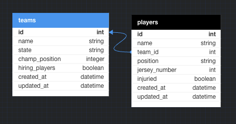

# README

This README would normally document whatever steps are necessary to get the
application up and running.

Things you may want to cover:

### Ruby version
- ruby 3.2.2
### System dependencies
- rails 7.1.3; 
- gems: 'rspec-rails', 'simplecov', 'capybara', 'pry', 'launchy', 'shoulda-matchers', 'orderly'
### Configuration

### Database creation
`bundle install`
`rails db:{drop,create,migrate,seed}`
### Database initialization
`bundle install`
`rails db:{drop,create,migrate,seed}`
### How to run the test suite
`bundle exec rspec`
### Services (job queues, cache servers, search engines, etc.)
- N/A
### Deployment instructions
`rails s`
### Database Schema:

